# 🔴 Sistem Pengaduan Pelanggaran Sekolah

<p align="center">
  <strong>Sistem Informasi Pengaduan & Aspirasi Pelanggaran Berbasis Web</strong><br>
  Dibangun dengan Laravel 12 &bull; Tailwind CSS 4 &bull; Vite 7
</p>

---

## 📋 Deskripsi Singkat

**Sistem Pengaduan Pelanggaran** adalah aplikasi web berbasis Laravel yang dirancang untuk memfasilitasi siswa dalam melaporkan berbagai bentuk pelanggaran yang terjadi di lingkungan sekolah. Sistem ini menyediakan platform digital yang memungkinkan siswa menyampaikan aspirasi atau pengaduan secara aman dan terstruktur kepada pihak admin sekolah.

Dengan sistem ini, setiap laporan pelanggaran — baik yang dilakukan oleh **siswa**, **guru**, maupun **staff** — dapat dikelola secara transparan melalui alur kerja yang jelas: mulai dari penerimaan laporan, proses tindak lanjut, pemberian umpan balik, hingga pengarsipan. Tujuannya adalah menciptakan lingkungan sekolah yang lebih aman, tertib, dan responsif terhadap keluhan siswa.

---

## 🎯 Fitur Lengkap Berdasarkan Role

### 👤 Role: Admin

| No | Fitur | Penjelasan |
|----|-------|------------|
| 1 | **Dashboard Statistik** | Menampilkan ringkasan data berupa jumlah total aspirasi, laporan menunggu, sedang diproses, selesai, dan total siswa terdaftar. Dilengkapi filter berdasarkan tanggal, bulan, siswa, jenis pelaku, dan status. |
| 2 | **Manajemen Aspirasi** | Melihat seluruh daftar aspirasi/laporan yang masuk dari siswa dengan fitur filter berdasarkan status dan pencarian kata kunci (keterangan, nama siswa, NIS). |
| 3 | **Detail Aspirasi** | Melihat detail lengkap setiap laporan termasuk informasi pelaku, keterangan kronologi, bukti gambar, dan status terkini. |
| 4 | **Update Status Laporan** | Mengubah status aspirasi dari *Menunggu* → *Proses* → *Selesai* untuk menunjukkan progres penanganan. |
| 5 | **Pemberian Feedback** | Memberikan umpan balik tertulis dan/atau mengunggah gambar sebagai bukti tindak lanjut atas laporan siswa. |
| 6 | **Histori Aspirasi** | Melihat daftar aspirasi yang sudah berstatus *Selesai* dan belum diarsipkan, dengan filter berdasarkan bulan dan tahun. |
| 7 | **Arsip Aspirasi** | Mengelola arsip aspirasi yang sudah diarsipkan. Admin dapat mengarsipkan laporan yang sudah selesai ditangani agar tidak muncul di daftar utama. |
| 8 | **Manajemen Akun Siswa** | CRUD (Create, Read, Update, Delete) data akun siswa meliputi NIS, username, kelas, dan password. |
| 9 | **Manajemen Jenis Pelaku** | Menambah dan menghapus kategori jenis pelaku pelanggaran (siswa, guru, staff). |

### 🎓 Role: Siswa

| No | Fitur | Penjelasan |
|----|-------|------------|
| 1 | **Dashboard Personal** | Menampilkan statistik laporan pribadi (total, menunggu, proses, selesai), aksi cepat untuk membuat laporan atau melihat histori, serta daftar laporan terbaru. |
| 2 | **Buat Laporan Baru** | Formulir untuk membuat laporan pelanggaran baru dengan memilih jenis pelaku, menulis keterangan kronologi secara detail, dan mengunggah bukti gambar (opsional). |
| 3 | **Daftar Aspirasi Saya** | Melihat seluruh laporan yang pernah dikirim dengan filter berdasarkan status (Menunggu/Proses/Selesai). |
| 4 | **Detail & Tracking Laporan** | Melihat detail laporan dengan timeline status progres visual (Menunggu → Proses → Selesai), serta membaca umpan balik dari admin. |
| 5 | **Histori Aspirasi** | Melihat daftar laporan yang sudah berstatus *Selesai* lengkap dengan tanggal penyelesaian. |

### 🔐 Fitur Umum (Semua Role)

| No | Fitur | Penjelasan |
|----|-------|------------|
| 1 | **Login Terpadu** | Satu halaman login untuk semua role. Sistem secara otomatis mendeteksi apakah pengguna adalah admin atau siswa berdasarkan username/NIS yang dimasukkan. |
| 2 | **Logout** | Mengakhiri sesi dan kembali ke halaman login dengan aman. |
| 3 | **Responsif** | Seluruh halaman mendukung tampilan mobile, tablet, dan desktop. |

---

## 🔄 Alur Kerja Sistem

```mermaid
flowchart TD
    A[🔐 Siswa Login] --> B[📊 Dashboard Siswa]
    B --> C[📝 Buat Laporan Baru]
    C --> D[Pilih Jenis Pelaku]
    D --> E[Isi Keterangan & Upload Bukti]
    E --> F[✅ Laporan Terkirim - Status: Menunggu]
    
    F --> G[🔐 Admin Login]
    G --> H[📊 Dashboard Admin]
    H --> I[📋 Lihat Daftar Aspirasi]
    I --> J[🔍 Review Detail Laporan]
    J --> K{Tindak Lanjut}
    
    K --> L[🔄 Ubah Status → Proses]
    L --> M[💬 Berikan Feedback + Bukti]
    M --> N[✅ Ubah Status → Selesai]
    N --> O[📦 Arsipkan Laporan]
    
    N --> P[📱 Siswa Cek Status & Feedback]
    O --> Q[📚 Tersimpan di Arsip]
```



### Penjelasan Alur:

1. **Siswa** melakukan login menggunakan username/NIS dan password.
2. Dari dashboard, siswa membuat **laporan baru** dengan memilih jenis pelaku, menulis kronologi pelanggaran, dan mengunggah bukti gambar (opsional).
3. Laporan terkirim dengan status awal **"Menunggu"**.
4. **Admin** login dan melihat laporan masuk di dashboard.
5. Admin me-review detail laporan, lalu mengubah status menjadi **"Proses"** saat mulai ditangani.
6. Admin memberikan **feedback** berupa tanggapan tertulis dan/atau bukti gambar tindak lanjut.
7. Setelah penanganan selesai, admin mengubah status menjadi **"Selesai"**.
8. Laporan yang sudah selesai dapat **diarsipkan** agar tidak muncul di daftar utama.
9. Siswa dapat memantau **progres dan feedback** dari admin melalui halaman detail laporan.

---

## 🛠️ Cara Instalasi & Menjalankan

### Prasyarat

Pastikan perangkat Anda sudah memiliki:

- **PHP** >= 8.2
- **Composer** >= 2.x
- **Node.js** >= 18.x & **NPM** >= 9.x
- **MySQL** >= 5.7 / **MariaDB** >= 10.3
- **Git** (opsional, untuk clone repository)
- **Laragon** / **XAMPP** / **WAMP** (untuk local development)

### Langkah Instalasi

```bash
# 1. Clone repository (atau extract file zip ke folder htdocs/www)
git clone https://github.com/username/sistem_pengaduan_pelanggaran.git
cd sistem_pengaduan_pelanggaran

# 2. Install dependency PHP via Composer
composer install

# 3. Salin file konfigurasi environment
cp .env.example .env

# 4. Generate application key
php artisan key:generate

# 5. Konfigurasi database di file .env
#    Buka file .env dan sesuaikan:
#    DB_DATABASE=db_pengaduan_pelanggaran
#    DB_USERNAME=root
#    DB_PASSWORD=

# 6. Buat database MySQL
#    Buka phpMyAdmin atau MySQL CLI, lalu buat database:
#    CREATE DATABASE db_pengaduan_pelanggaran;

# 7. Jalankan migrasi database
php artisan migrate

# 8. Jalankan seeder untuk data demo
php artisan db:seed

# 9. Install dependency frontend
npm install

# 10. Build asset frontend
npm run build
```

### Menjalankan Aplikasi

```bash
# Opsi 1: Menggunakan Laravel Development Server
php artisan serve
# Aplikasi berjalan di: http://127.0.0.1:8000

# Opsi 2: Menggunakan Laragon
# Cukup letakkan folder project di C:\laragon\www\
# Akses melalui: http://sistem_pengaduan_pelanggaran.test

# Opsi 3: Development mode (dengan hot-reload Vite)
# Terminal 1:
php artisan serve
# Terminal 2:
npm run dev
```

> **💡 Tips:** Jika menggunakan Laragon, Anda tidak perlu menjalankan `php artisan serve` karena Laragon sudah menangani server secara otomatis.

---

## 🔑 Akses Aplikasi (Demo)

Setelah menjalankan `php artisan db:seed`, gunakan akun berikut untuk mengakses aplikasi:

### Admin

| Field | Nilai |
|-------|-------|
| URL Login | `http://localhost:8000/login` |
| Username | `admin` |
| Password | `password` |
| Redirect | `/admin/dashboard` |

### Siswa

| Field | Siswa 1 | Siswa 2 | Siswa 3 |
|-------|---------|---------|---------|
| Username | `siswa001` | `siswa002` | `siswa003` |
| NIS | `12345` | `12346` | `12347` |
| Kelas | XII IPA 1 | XII IPA 2 | XI IPS 1 |
| Password | `password` | `password` | `password` |
| Redirect | `/siswa/dashboard` | `/siswa/dashboard` | `/siswa/dashboard` |

> **📌 Catatan:** Login menggunakan **username** atau **NIS** (khusus siswa). Sistem secara otomatis mendeteksi role berdasarkan kredensial yang dimasukkan.

---

## 🗄️ Struktur Database

Sistem menggunakan **5 tabel utama** + 3 tabel pendukung Laravel:

### Entity Relationship Diagram (ERD)


### Penjelasan Tabel

| Tabel | Deskripsi |
|-------|-----------|
| `admin` | Menyimpan data akun administrator sistem |
| `siswa` | Menyimpan data akun siswa (NIS, kelas, username, password) |
| `pelaku` | Menyimpan kategori jenis pelaku pelanggaran (siswa/guru/staff) |
| `input_aspirasi` | Menyimpan data input laporan dari siswa (keterangan, bukti gambar) dengan relasi ke tabel siswa dan pelaku |
| `aspirasi` | Menyimpan status penanganan, feedback admin, gambar tindak lanjut, dan status arsip. Berelasi ke input_aspirasi dan admin |

### Tabel Pendukung Laravel

| Tabel | Deskripsi |
|-------|-----------|
| `sessions` | Menyimpan data sesi pengguna |
| `cache` | Menyimpan data cache aplikasi |
| `jobs` | Menyimpan antrian pekerjaan background |

---

## ⚙️ Teknologi yang Digunakan

### Backend

| Teknologi | Versi | Keterangan |
|-----------|-------|------------|
| **PHP** | ^8.2 | Bahasa pemrograman server-side |
| **Laravel** | ^12.0 | Framework PHP untuk arsitektur MVC |
| **Laravel Tinker** | ^2.10.1 | REPL interaktif untuk debugging |
| **MySQL / MariaDB** | 5.7+ / 10.3+ | Database relasional |
| **Composer** | 2.x | Dependency manager untuk PHP |

### Frontend

| Teknologi | Versi | Keterangan |
|-----------|-------|------------|
| **Tailwind CSS** | ^4.0.0 | Framework CSS utility-first |
| **Vite** | ^7.0.7 | Build tool frontend modern |
| **Blade** | (Laravel built-in) | Template engine bawaan Laravel |
| **Axios** | ^1.11.0 | HTTP client untuk request AJAX |

### Development Tools

| Teknologi | Versi | Keterangan |
|-----------|-------|------------|
| **Laravel Pint** | ^1.24 | Code formatter/linter PHP |
| **Laravel Pail** | ^1.2.2 | Real-time log viewer |
| **Laravel Sail** | ^1.41 | Docker development environment |
| **PHPUnit** | ^11.5.3 | Testing framework |
| **Concurrently** | ^9.0.1 | Menjalankan multiple commands bersamaan |

---

## 🔒 Keamanan Sistem

### Mekanisme Keamanan

| Fitur Keamanan | Penjelasan |
|----------------|------------|
| **CSRF Protection** | Setiap form menggunakan token `@csrf` untuk mencegah serangan Cross-Site Request Forgery. Token ini divalidasi otomatis oleh Laravel pada setiap request POST/PUT/PATCH/DELETE. |
| **Middleware Authentication** | Dua middleware khusus (`AdminMiddleware` dan `SiswaMiddleware`) melindungi setiap route, memastikan hanya pengguna yang sudah login yang dapat mengakses halaman tertentu sesuai role-nya. |
| **Session-Based Auth** | Autentikasi menggunakan session yang tersimpan di server. Data sesi terenkripsi dan memiliki masa aktif (lifetime) 120 menit. |
| **Input Validation** | Setiap data yang masuk divalidasi menggunakan Laravel Validation rules, mencegah data tidak valid atau berbahaya masuk ke database. |
| **File Upload Validation** | Upload gambar dibatasi hanya untuk file bertipe image dengan ukuran maksimal 2MB, mencegah upload file berbahaya. |
| **Route Protection** | Semua route admin dilindungi prefix `/admin` dengan middleware admin. Route siswa dilindungi prefix `/siswa` dengan middleware siswa. |
| **SQL Injection Prevention** | Menggunakan Eloquent ORM dan Query Builder Laravel yang secara otomatis melakukan parameterized queries. |

### Tampilan User-Friendly

| Aspek | Penjelasan |
|-------|------------|
| **Desain Modern (Red Theme)** | Seluruh antarmuka menggunakan palet warna merah/rose yang konsisten dengan gradient, glassmorphism, dan shadow yang memberikan kesan profesional dan elegan. |
| **Animasi Halus** | Terdapat animasi `fadeIn`, `slideUp`, `scaleIn`, dan `float` yang memberikan transisi visual yang smooth saat halaman dimuat, meningkatkan pengalaman pengguna. |
| **Hover Effects Interaktif** | Setiap elemen interaktif (kartu, tombol, baris tabel, link navigasi) memiliki efek hover yang responsif — seperti skala, bayangan, dan perubahan warna — untuk memberikan visual feedback langsung kepada pengguna. |
| **Fully Responsive** | Layout menyesuaikan secara otomatis untuk berbagai ukuran layar: mobile (< 640px), tablet (640-1024px), dan desktop (> 1024px). Sidebar admin dapat di-toggle pada mobile, dan tabel menerapkan horizontal scroll. |
| **Status Visual yang Jelas** | Setiap status laporan ditampilkan dengan badge berwarna yang mudah dibedakan: kuning (Menunggu), oranye (Proses), dan hijau (Selesai). |
| **Timeline Progres** | Halaman detail laporan siswa menampilkan timeline visual dengan langkah-langkah yang menunjukkan progres penanganan secara intuitif. |
| **Empty State** | Ketika tidak ada data, ditampilkan ilustrasi dan pesan yang informatif beserta tombol aksi, sehingga pengguna tidak kebingungan. |
| **Flash Messages** | Notifikasi sukses/error ditampilkan setelah setiap aksi (submit, update, delete) untuk memberikan konfirmasi kepada pengguna. |
| **Custom Scrollbar** | Scrollbar menggunakan style kustom yang sesuai dengan tema merah aplikasi, memberikan detail finishing yang premium. |
| **Navigasi Intuitif** | Sidebar admin dan navbar siswa menampilkan ikon navigasi yang jelas dengan indikator halaman aktif, memudahkan pengguna berpindah antar fitur. |

---

## ⭐ Fitur Unggulan

### 1. 🔑 Login Terpadu (Unified Login)
Satu halaman login untuk semua role. Tidak perlu memilih role terlebih dahulu — cukup masukkan username/NIS dan password, sistem otomatis mengenali apakah pengguna adalah admin atau siswa dan mengarahkan ke dashboard yang sesuai.

### 2. 📊 Dashboard Real-Time dengan Filter Canggih
Dashboard admin menampilkan statistik real-time dan mendukung filter multi-dimensi: berdasarkan tanggal, bulan, nama siswa, jenis pelaku, dan status. Memudahkan admin menganalisis tren pelanggaran.

### 3. 🔄 Sistem Tracking Status 3 Tahap
Setiap laporan memiliki alur status yang transparan: **Menunggu → Proses → Selesai**. Siswa dapat memantau progres laporannya secara real-time melalui timeline visual yang intuitif.

### 4. 💬 Feedback Dua Arah dengan Bukti Visual
Admin dapat memberikan umpan balik berupa teks dan gambar. Siswa dapat melihat tanggapan ini langsung di halaman detail laporan, menciptakan komunikasi yang transparan.

### 5. 📦 Sistem Arsip Terstruktur
Laporan yang sudah selesai dapat diarsipkan sehingga tidak mengotori daftar utama, namun tetap tersimpan dan dapat diakses kembali melalui halaman arsip. Ideal untuk keperluan dokumentasi dan audit.

### 6. 📸 Upload Bukti Gambar
Baik siswa (saat membuat laporan) maupun admin (saat memberikan feedback) dapat mengunggah gambar sebagai bukti visual, memperkuat validitas laporan dan tindak lanjut.

### 7. 🎨 Desain Premium dengan Animasi Modern
Antarmuka menggunakan teknik desain modern seperti **glassmorphism**, **gradient merah**, **animated floating elements**, dan **micro-animations** yang memberikan kesan profesional dan menyenangkan untuk digunakan.

### 8. 📱 Fully Responsive dengan Mobile-First
Seluruh halaman dioptimalkan untuk perangkat mobile dengan sidebar toggle, horizontal scroll table, dan layout yang adaptif. Siswa dapat membuat laporan dari smartphone kapan saja.

### 9. 🔍 Pencarian & Filter Multi-Kriteria
Admin dapat mencari laporan berdasarkan kata kunci (keterangan, nama siswa, NIS), memfilter berdasarkan status, dan menyortir data. Halaman histori mendukung filter berdasarkan bulan dan tahun.

### 10. 🛡️ Keamanan Berlapis
Proteksi CSRF, middleware per-role, validasi input, pembatasan upload file, dan pencegahan SQL injection memastikan data dan sistem tetap aman dari ancaman keamanan web umum.

---

## 📁 Struktur Folder Proyek

```
sistem_pengaduan_pelanggaran/
├── app/
│   ├── Http/
│   │   ├── Controllers/
│   │   │   ├── Auth/
│   │   │   │   └── LoginController.php       # Controller login terpadu
│   │   │   ├── Admin/
│   │   │   │   ├── DashboardController.php    # Dashboard & statistik admin
│   │   │   │   ├── AspirasiController.php     # CRUD aspirasi (admin)
│   │   │   │   ├── PelakuController.php       # Manajemen jenis pelaku
│   │   │   │   └── SiswaController.php        # CRUD akun siswa
│   │   │   └── Siswa/
│   │   │       ├── DashboardController.php    # Dashboard siswa
│   │   │       └── AspirasiController.php     # CRUD aspirasi (siswa)
│   │   └── Middleware/
│   │       ├── AdminMiddleware.php            # Proteksi route admin
│   │       └── SiswaMiddleware.php            # Proteksi route siswa
│   └── Models/
│       ├── Admin.php                          # Model admin
│       ├── Aspirasi.php                       # Model aspirasi
│       ├── InputAspirasi.php                  # Model input aspirasi
│       ├── Pelaku.php                         # Model pelaku
│       └── Siswa.php                          # Model siswa
├── database/
│   ├── migrations/                            # File migrasi database
│   └── seeders/
│       └── DatabaseSeeder.php                 # Data demo/seeder
├── resources/views/
│   ├── layouts/
│   │   ├── app.blade.php                      # Layout dasar + animasi global
│   │   ├── admin.blade.php                    # Layout admin (sidebar)
│   │   └── siswa.blade.php                    # Layout siswa (navbar)
│   ├── auth/
│   │   └── login.blade.php                    # Halaman login terpadu
│   ├── admin/
│   │   ├── dashboard.blade.php                # Dashboard admin
│   │   ├── aspirasi/                          # Views aspirasi admin
│   │   │   ├── index.blade.php
│   │   │   ├── show.blade.php
│   │   │   ├── histori.blade.php
│   │   │   └── arsip.blade.php
│   │   ├── siswa/                             # Views manajemen siswa
│   │   │   ├── index.blade.php
│   │   │   ├── create.blade.php
│   │   │   └── edit.blade.php
│   │   └── pelaku/
│   │       └── index.blade.php                # Manajemen jenis pelaku
│   └── siswa/
│       ├── dashboard.blade.php                # Dashboard siswa
│       └── aspirasi/                          # Views aspirasi siswa
│           ├── index.blade.php
│           ├── create.blade.php
│           ├── show.blade.php
│           └── histori.blade.php
├── routes/
│   └── web.php                                # Definisi semua route
├── .env                                       # Konfigurasi environment
├── composer.json                              # Dependency PHP
└── package.json                               # Dependency frontend
```

---

## 📄 Lisensi

Proyek ini dikembangkan untuk keperluan edukasi dan tugas sekolah.

---

<p align="center">
  Dibuat dengan ❤️ menggunakan <strong>Laravel 12</strong> &bull; <strong>Tailwind CSS 4</strong> &bull; <strong>Vite 7</strong>
</p>
# pengaduan-pelanggaran-ujikom


